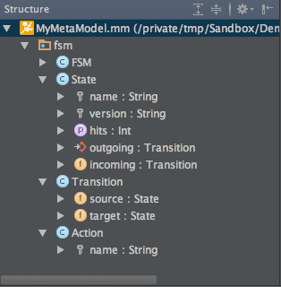

# StructureView

The Structure View provides a convenient quick access to the conceps, and a syntectical view of the attributes, relations and their specificities.

Different Icons are used to differenciate:
- Attributes
- Identifier Attributes
- References
- Contained References

The Structure View also allows to sort the elements by Alphabetical order or by Kind.

[Figure 7: Structure View](id:fig-newProject)
