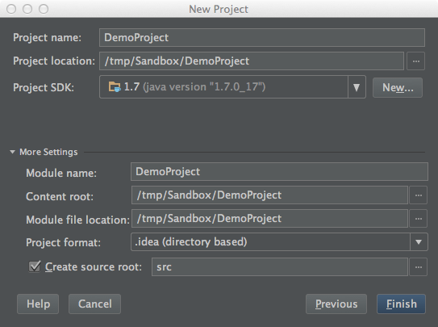
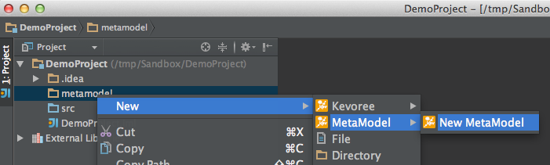
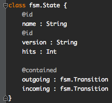
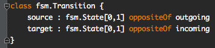
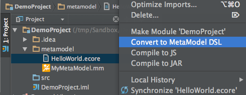
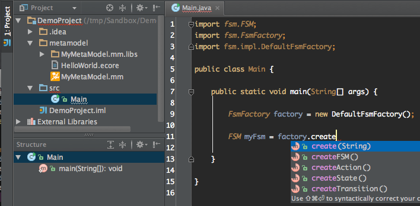

# Quick Start

You want to rapidly prototype a model-based application, you have a model and are tired openning Eclipse just to update the Meta-Model: Here's where you start.

### Install
Open IntelliJ and install the Kevoree Modeling Framework IDEA Plugin.

### From Scratch !
#### Create a new project.

[Figure 1: Create a project](id:fig-newProject)

#### Create a new MetaModel.

[Figure 2: Create a MetaModel](id:fig-newMetaModel)

#### Describe your concepts.

[Figure 3: Specify the concepts](id:fig-fieldTypes)

A field is considered as an Attribute of the concept if its type is a primitive type.

An Attribute, or set of attributes, can be declared as identifiers of the concept using the *@id* annotation. If the id is composed by a group of attribute, the technical id will be computed using the atrributes valiues, in the alphabetical order on the name of attributes.

[Figure 4: Cardinalities & Opposite](id:fig-cardOpp)

References are specified by typing a field with another Concept from the MetaModel. The cardinality of the relation is specified using brackets after the type of the reference.

The Containment of a reference is specified using the *@contained* annotation.

The opposite relation is specified using the *oppositeOf* keyword.

### From Existing Ecore model !

Create a peoject and copy/paste your Ecore model.
Right-click and Select `Convert to MetaModel DSL`.

[Figure 5: Convert & Compile](id:fig-convertAndCompile)

Then Edit !

### Use it !

Right-click on your MetaModel file, and compile it to Jar (for Java-based projects) or to JavaScript (JS, for Web-based projects).

[Figure 6: Use It](id:fig-useIt)

The code to manipulate models conforming to your MetaModel will be generated and added as a library of the project.
You can then use the concepts right away in your prototype implementation.

